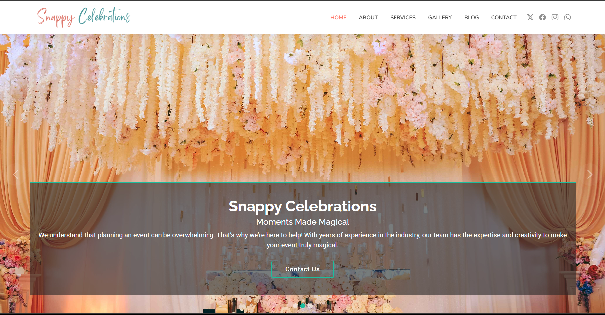
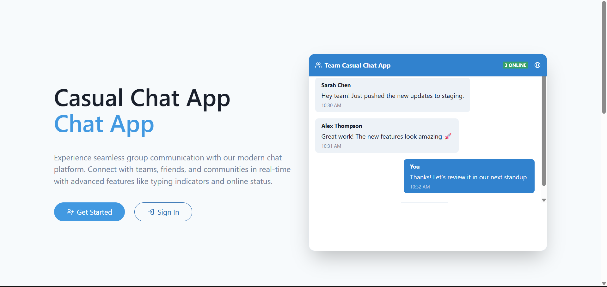
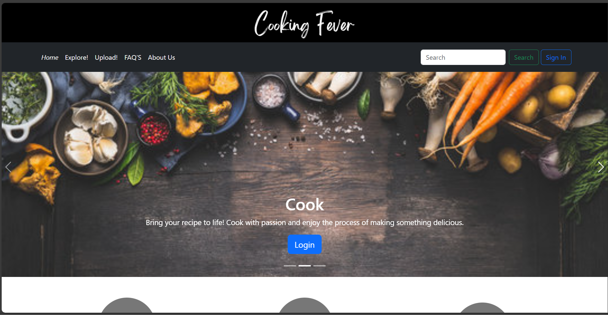

# Personal Portfolio Website

A modern, responsive portfolio website built with React and Material-UI, featuring smooth animations and a clean design.



## 🚀 Features

- Responsive design that works on all devices
- Dark/Light mode support
- Smooth animations using Framer Motion
- Project showcase section
- Modern UI with Material-UI components
- Interactive project cards with live preview and GitHub links

## 🛠️ Technologies Used

### Core Technologies
- **React** - Frontend framework
  - Used for building the component-based architecture
  - Implements functional components with hooks
  - Manages state and props for dynamic content

### UI/UX
- **Material-UI (MUI)**
  - Components used:
    - `Box`, `Container`, `Typography`, `Grid` for layout
    - `Card`, `CardContent`, `CardActions` for project cards
    - `Button`, `IconButton` for interactive elements
    - `Paper` for elevated surfaces
    - `useTheme` hook for dark/light mode theming
  - Custom styling using MUI's `sx` prop system
  - Responsive design using MUI's breakpoint system

### Animation
- **Framer Motion**
  - Used for:
    - Page transitions and scroll animations
    - Project card reveal animations
    - Smooth hover effects
    - Viewport-based animations using `whileInView`

### Icons and Assets
- **Material Icons**
  - `ArrowForwardIcon` for navigation
  - `GitHubIcon` for project links
  - `WebIcon` for live previews

### Development Tools
- **GitHub Pages** - Deployment platform
- **npm** - Package management
- **ESLint** - Code linting
- **Prettier** - Code formatting

### Project Structure
```
my-react-app/
├── port/
│   ├── src/
│   │   ├── assets/
│   │   │   └── projects/         # Project screenshots
│   │   ├── sections/            # Main page sections
│   │   │   └── Projects.jsx     # Projects section component
│   │   ├── App.jsx             # Main application component
│   │   └── index.jsx           # Application entry point
│   ├── public/                 # Static files
│   └── package.json           # Project dependencies
```

## 🚀 Getting Started

1. Clone the repository:
```bash
git clone https://github.com/yourusername/portfolio.git
```

2. Install dependencies:
```bash
cd my-react-app/port
npm install
```

3. Start the development server:
```bash
npm start
```

4. Open [http://localhost:3000](http://localhost:3000) to view it in your browser.

## 📸 Screenshots

### Projects Section


### Project Card


## 🎨 Customization

1. Update project information in `src/sections/Projects.jsx`
2. Add your own project screenshots to `src/assets/projects/`
3. Modify the theme in your Material-UI configuration

## 📝 License

This project is licensed under the MIT License - see the [LICENSE](LICENSE) file for details.

## 👤 Author

Your Name
- GitHub: [@yourusername](https://github.com/yourusername)
- LinkedIn: [Your LinkedIn](https://linkedin.com/in/yourusername)

## 🙏 Acknowledgments

- Material-UI for the component library
- Framer Motion for the animations
- All the open-source projects that made this possible 